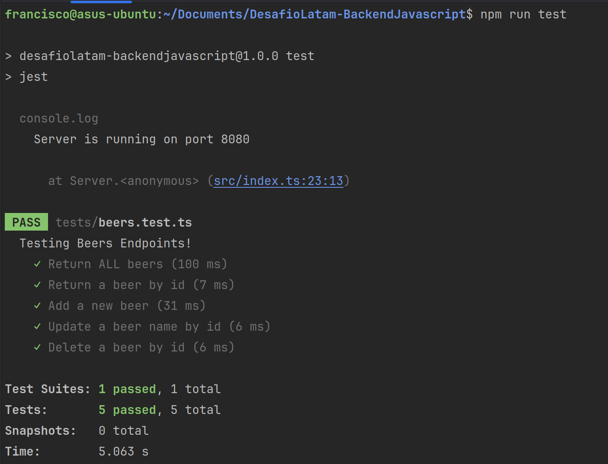

# DesafioLatam – Backend JavaScript

A **TypeScript + Express** backend built for the Desafío Latam back-end JavaScript curriculum. It demonstrates REST API design, JWT authentication, role-based authorization, PostgreSQL persistence via Sequelize, an in-memory FIFO message queue, and real-time messaging with Socket.IO.

---

## Features

| Feature | Details |
|---|---|
| Beer CRUD API | Full Create / Read / Update / Delete for beers, protected by JWT and admin role |
| User auth | Register + login with bcrypt password hashing and JWT token generation |
| In-memory message queue | `POST /send` → `GET /receive` FIFO queue |
| Content-based routing | `GET /api/route?type=text\|json` example |
| Real-time chat | Socket.IO events with randomly assigned animal usernames |
| Browser client | Static demo page served from `public/index.html` |

---

## Tech Stack

| Layer | Technology |
|---|---|
| Runtime | Node.js ≥ 18 |
| Framework | Express 4 |
| Language | TypeScript 5 (compiled to CommonJS, output → `dist/`) |
| ORM / DB | Sequelize 6 + PostgreSQL (`pg`) |
| Auth | jsonwebtoken, bcrypt, cookie-parser |
| Realtime | Socket.IO 4 |
| Logging | morgan |
| Config | dotenv |
| Testing | Jest 29, ts-jest, Supertest |
| Dev server | nodemon + ts-node |

> **Note:** `swagger-jsdoc` and `swagger-ui-express` are installed as dependencies but no Swagger route has been wired up in the current source.

---

## Project Structure

```
.
├── beers.sql                  # PostgreSQL dump (legacy schema, for reference)
├── jest.config.js             # Jest / ts-jest configuration
├── tsconfig.json              # TypeScript compiler options
├── types.d.ts                 # Shared TypeScript types and Sequelize model classes
├── public/
│   └── index.html             # Static Socket.IO demo client
├── src/
│   ├── index.ts               # App entry point, middleware, server startup
│   ├── database/
│   │   ├── db.ts              # Sequelize instance (reads env vars)
│   │   ├── beers.schema.ts    # Beer Sequelize model definition
│   │   └── users.schema.ts    # User Sequelize model definition
│   ├── models/
│   │   ├── beers.model.ts     # Beer data-access functions
│   │   └── users.model.ts     # User data-access functions
│   ├── controllers/
│   │   ├── beers.controller.ts
│   │   └── users.controller.ts
│   ├── routes/
│   │   ├── beers.route.ts
│   │   ├── users.route.ts
│   │   ├── messages.route.ts
│   │   └── views.route.ts
│   ├── middlewares/
│   │   └── auth.middleware.ts  # isLogged, isAdmin, validUserData, userAvailable
│   └── utils/
│       ├── jwt.utils.ts        # generateToken
│       ├── brcrypt.utils.ts    # hashPassword, comparePassword
│       ├── userGenerator.ts    # Random animal username assignment
│       └── socket.utils.ts     # Socket.IO server setup
└── tests/
    └── beers.test.ts           # Jest + Supertest beer endpoint tests
```

---

## Prerequisites

- **Node.js ≥ 18**
- **npm**
- A running **PostgreSQL** instance

---

## Installation

```bash
npm install
```

---

## Environment Variables

Create a `.env` file in the project root (`.env` is git-ignored):

```dotenv
# PostgreSQL connection
DB_HOST=localhost
DB_DATABASE=your_database
DB_USER=your_user
DB_PASSWORD=your_password

# Server (optional, defaults to 3000)
PORT=3000

# JWT signing secret (optional, defaults to "secret" – change in production!)
JWT_SECRET=your_jwt_secret
```

| Variable | Required | Default | Source |
|---|---|---|---|
| `DB_HOST` | ✅ | — | `src/database/db.ts:11` |
| `DB_DATABASE` | ✅ | — | `src/database/db.ts:6` |
| `DB_USER` | ✅ | — | `src/database/db.ts:7` |
| `DB_PASSWORD` | ✅ | — | `src/database/db.ts:8` |
| `PORT` | ❌ | `3000` | `src/index.ts:106` |
| `JWT_SECRET` | ❌ | `"secret"` | `src/utils/jwt.utils.ts:4` |

> **Warning:** Never use the default `JWT_SECRET` value outside of local development.

---

## Running Locally

### Development (hot-reload via nodemon + ts-node)

```bash
npm run dev
```

Watches `src/**/*.{ts,yaml}` and restarts automatically.

### Production build

```bash
npm run build   # Compiles TypeScript → dist/
npm start       # Runs dist/index.js
```

Once running, the server is available at `http://localhost:3000` (or the configured `PORT`).  
The Socket.IO demo client is served at **`http://localhost:3000/`** from `public/index.html`.

> **⚠️ Database sync warning:** On every startup the app calls `sequelize.sync({ force: true })`, which **drops and recreates all tables**. This is fine for development but must be changed before deploying to a production environment.

---

## API Reference

All JSON responses follow the shape `{ status: "success"|"error", payload?|message? }`.

### Authentication

| Method | Route | Body | Auth | Description |
|---|---|---|---|---|
| `POST` | `/auth/register` | `{ username, password }` | None | Create a new user |
| `POST` | `/auth/login` | `{ username, password }` | None | Returns a JWT token |

**Login response:**
```json
{ "status": "success", "message": "User logged in", "token": "<jwt>" }
```

Authenticated requests must include the token as a **Bearer token**:
```
Authorization: Bearer <token>
```

---

### Beers

Base path: `/api/beers`

| Method | Route | Auth | Role | Description |
|---|---|---|---|---|
| `GET` | `/api/beers/` | ✅ JWT | Any | Get all beers |
| `GET` | `/api/beers/:id` | ✅ JWT | Any | Get a beer by id |
| `POST` | `/api/beers/` | ✅ JWT | Admin | Add a new beer |
| `PUT` | `/api/beers/:id` | ✅ JWT | Admin | Update a beer's `cerveceria` field |
| `DELETE` | `/api/beers/:id` | ✅ JWT | Admin | Delete a beer |

**Beer object fields:**

| Field | Type | Required | Description |
|---|---|---|---|
| `nombre` | string | ✅ | Beer name |
| `cerveceria` | string | ✅ | Brewery name |
| `origen` | string | ❌ | Country/region of origin |
| `estilo` | string | ❌ | Beer style (e.g. IPA, APA) |
| `alcohol` | float | ❌ | Alcohol by volume |
| `premios` | string | ❌ | Awards |
| `ibu` | integer | ❌ | Bitterness units |

---

### Message Queue (in-memory)

| Method | Route | Body | Description |
|---|---|---|---|
| `POST` | `/send` | `{ message: string }` | Push a message onto the FIFO queue |
| `GET` | `/receive` | — | Shift and return the next message, or `204` if empty |

---

### Content-based routing example

```
GET /api/route?type=text   → plain text response
GET /api/route?type=json   → JSON response
GET /api/route             → 400 Bad Request
```

---

## WebSocket / Real-time Chat

When the server starts, a Socket.IO server is attached to the same HTTP server instance (`src/utils/socket.utils.ts`).

### Events

| Direction | Event | Payload | Description |
|---|---|---|---|
| Server → Client | `setUsername` | `string` | Assigns a random animal username on connect |
| Client → Server | `message` | `string` | Broadcasts a chat message |
| Server → All | `message` | `"<username>: <text>"` | Broadcast to all connected clients |

### Browser client

Open `http://localhost:3000/` in multiple browser tabs to use the demo chat client built with plain HTML and the Socket.IO CDN.

---

## Testing

```bash
npm test
```

Tests use **Jest 29** with **ts-jest** and **Supertest**. The current test suite (`tests/beers.test.ts`) covers all five beer endpoints with mocked model functions — no live database connection required.

### Screenshot


---

## Scripts

| Script | Command | Description |
|---|---|---|
| `npm start` | `node dist/index.js` | Run compiled production build |
| `npm run dev` | `nodemon … ts-node src/index.ts` | Dev server with hot-reload |
| `npm run build` | `tsc` | Compile TypeScript to `dist/` |
| `npm test` | `jest` | Run test suite |

---

## Known Limitations

- `sequelize.sync({ force: true })` drops tables on every boot — **not** suitable for production as-is.
- `swagger-jsdoc` / `swagger-ui-express` are installed but no `/api-docs` route is configured.
- No linter (ESLint etc.) is configured.
- The included `beers.sql` dump schema omits the `nombre` column present in the Sequelize model (`src/database/beers.schema.ts`).

---

## License

ISC
